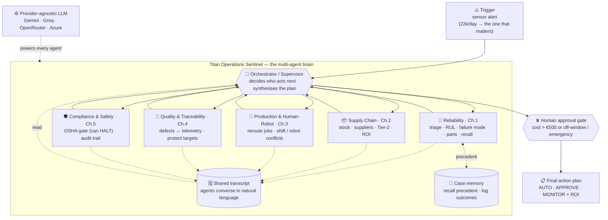

# 🛰️ Titan Operations Sentinel (TOS)

> A multi-agent **operations brain** for a smart factory. One sensor alert sets off a team of
> AI agents that reason across maintenance, supply chain, production, quality and safety — and
> hand a single, costed, safety-gated action plan to a human for approval.

Group project for **IE University — Agentic AI for IT**. Built on **LangGraph** with autonomous
**ReAct** agents and a **provider-agnostic** LLM layer (Gemini / Groq / OpenRouter / Azure OpenAI,
switchable live) — runs end-to-end on a **free tier**, no paid keys required.

`6 agents` · `5 TMC challenges` · `79.7:1 action ROI` · `€0 to run` · `26 offline tests`

---

## Contents

1. [The problem](#the-problem-the-case-study)
2. [The solution](#the-solution)
3. [Architecture at a glance](#architecture-at-a-glance)
4. [The agents](#the-agents)
5. [How it works](#how-it-works)
6. [The learning loop](#the-learning-loop)
7. [Autonomy & safety](#autonomy--safety)
8. [The three demo paths](#the-three-demo-paths)
9. [Worked example: the Friday Cascade](#worked-example-the-friday-cascade)
10. [Quick start (CLI)](#quick-start-cli)
11. [The web console](#the-web-console)
12. [Providers & models](#providers--models)
13. [Testing](#testing)
14. [Trace event contract](#trace-event-contract)
15. [Repository layout](#repository-layout)
16. [Design choices worth knowing](#design-choices-worth-knowing)
17. [How it maps to the assignment](#how-it-maps-to-the-assignment)
18. [Key numbers](#key-numbers)
19. [Status & limitations](#status--limitations)
20. [Docs & appendix](#docs--appendix)
21. [Team](#team)

---

## The problem (the case study)

Titan Manufacturing runs 28 plants of robots bolted onto aging operational technology. Its pain is
**fragmented intelligence and manual decision loops** — every team sees its own slice:

| # | Challenge | The hurt (from the case study) |
|---|-----------|--------------------------------|
| 1 | Predictive maintenance | 22,000+ alerts/day with no prioritisation; **€180k/day** when a CNC goes down; 38% of failures "should have been predicted" |
| 2 | Supply-chain volatility | **€14M** in line stoppages last quarter; expediting costs up 52%; zero visibility past Tier-1 suppliers |
| 3 | Human-robot coordination | 17% of shifts hit robot/operator conflicts; safety shutdowns up 15% |
| 4 | Quality & traceability | quality escapes up 22%; defect root-cause takes weeks; QMS not linked to machine telemetry |
| 5 | Compliance, safety & audit | OSHA log gaps; audits cross-reference 20+ systems by hand |

A dashboard shows the data. An automation script follows fixed rules. **Neither reasons across the
silos when something goes wrong** — which is exactly what's needed, and what an agentic system does.

## The solution

When a failure signal appears, TOS doesn't just raise a ticket — it **runs the whole response**:
diagnoses the failure, recalls similar past incidents, finds the parts, reroutes production without
breaking the shift plan, checks the quality fallout, gets a safety sign-off, computes the ROI, and
drafts the approval request. One event flows through **all five challenges** as a single coordinated
cascade, with a human kept in the loop only where authority is actually required.

---

## Architecture at a glance



**Read it as:** a trigger arrives → the **orchestrator** routes it to specialist agents one at a
time → each agent does its own tool-calling and writes a natural-language report to a **shared
transcript** the others read → before anything commits, **Compliance & Safety** gates it and a
**human** approves the spend → a tiered **action plan** comes out, and the run is logged to case
memory.

---

## The agents

| Agent | Challenge | Decides | Key tools |
|-------|-----------|---------|-----------|
| **Orchestrator** | coordination | who acts next; the final tiered plan | (routing only) |
| **Reliability** | 1 | which alert matters, RUL, failure mode, parts, precedent | `alert_triage`, `sensor_query`, `rul_predictor`, `recall_similar_cases`, `asset_profile` |
| **Supply Chain** | 2 | parts gap, sourcing option by ROI, hidden Tier-2 risk | `parts_inventory`, `supplier_catalog`, `expedite_cost`, `tier2_supplier_risk` |
| **Production & Human-Robot** | 3 | how to reroute jobs without a staffing/robot conflict | `job_reroute`, `robot_cell_status`, `shift_conflict_check` |
| **Quality & Traceability** | 4 | is the fault causing defects; are reroute targets safe | `quality_history`, `telemetry_correlate` |
| **Compliance & Safety** | 5 | gate every action vs OSHA (can **HALT**); build audit trail | `safety_gate`, `audit_assemble` |

> **Agent decides → tools act.** The agents interpret, plan and choose tools; the tools only fetch
> data, compute, or draft artifacts — they never make decisions or commit irreversible actions.
> (Shared/scheduling tools: `maintenance_schedule`, `work_order_draft`, `notify`.)

---

## How it works

- **Autonomous specialists.** Each agent is a LangGraph `create_react_agent` — its LLM picks which of
  its own tools to call and loops until done.
- **Guided routing.** The orchestrator (an LLM) decides who runs next, constrained by a policy
  (`_allowed_next()`) that guarantees coverage on a high-risk event and always finishes through the
  safety gate (so it can't loop or skip safety). Each routing step is tagged **LLM-picked** vs
  **forced** in the trace.
- **Natural-language communication.** Every agent appends its full report to a **shared transcript**
  that all later agents read. An agent can end with `FOLLOWUP: <agent> — <question>` to put a direct
  question to another specialist (validated against the agent list and bounded by `MAX_VISITS`).
- **Structured verdicts.** Risk / HALT / escalate are read from structured tool fields
  (`rul_predictor.failure_mode`, `safety_gate.verdict`) parsed back from tool results, with text
  matching only as a fallback.
- **Safety override.** Compliance & Safety can return **HALT**, which stops the whole plan regardless
  of cost or urgency.
- **Human-in-the-loop.** Spend over €500 (or an option that doesn't fit the failure window) pauses
  the graph via `interrupt()` for a real approve/reject before anything is committed.
- **Full audit trail.** Every perception, tool call, decision and approval is written to
  `logs/tos_audit.jsonl` — replayable later with `scripts/view_run.py`.

---

## The learning loop

`perceive → reason → act → learn`, without retraining the model. Four mechanisms:

| Mechanism | Status | What it does |
|---|---|---|
| **Case memory (recall)** | live | `recall_similar_cases` retrieves the closest past incident (predicted-vs-actual RUL, decision, outcome) into the reliability agent's context, so it reasons from precedent. |
| **Write-back** | live | `graph.synthesize()` appends every closed run to `data/memory/case_library.json` with the predicted RUL window (`append_case`). |
| **Outcome validation (reconcile)** | live, self-closing | `reconcile_due()` runs on `perceive`; when an outcome is known (a telemetry/maintenance feed writes `data/memory/outcomes.json`) it resolves the case and updates RUL accuracy. Safe no-op without a feed. |
| **Reflection + signature down-weighting** | design | The `self_eval` prompt scores each plan today; persisting/replaying critiques and auto-down-weighting signatures that miss are the production design (labelled **"design"** in the console). |

All live mechanisms are unit-tested (`test_append_case_grows_library`, `test_reconcile_closes_the_loop`,
`test_reconcile_due_resolves_known_outcomes`).

---

## Autonomy & safety

Actions are classified into three tiers; the ceiling is **enforced in code**, not just the prompt.

| Tier | Example actions | Who approves |
|------|-----------------|--------------|
| **AUTO** | throttle within OEM limits, reroute jobs, update logs, draft a work order | none — the agent executes |
| **APPROVE** | any purchase, emergency maintenance window | plant manager (via the gate) |
| **ESCALATE** | anything touching safety systems | safety officer |

- **€500 ceiling (code-enforced).** A sourcing option runs autonomously **only if it is under €500
  *and* fits the failure window**; otherwise the run pauses for a human. (`graph.py` supply_chain;
  tests for both branches.)
- **Compliance HALT** overrides everything.
- **Abstain on thin data.** On telemetry dropout, Reliability refuses to fabricate a RUL and the run
  escalates for manual inspection (deterministic, zero-token).
- **Fail toward caution.** A failed agent/tool degrades to a noted error; reliability errors set
  risk = HIGH.

---

## The three demo paths

| Path | Trigger | What the agents do |
|------|---------|--------------------|
| **Cascade (happy)** | Friday Cascade alert | Full team runs → expedite parts, reroute jobs (conflict-aware), confirm quality, safety sign-off → **human approves** → costed plan |
| **Edge** | Supplier disruption | Supply Chain finds nothing fits the failure window → **adapts** to a cross-plant transfer (€420, under the ceiling → **autonomous**, no gate) |
| **Escalation** | Telemetry dropout | Reliability refuses to predict on partial data → orchestrator **stops and escalates** for manual inspection |

---

## Worked example: the Friday Cascade

**Trigger** — `ALT-22847`: CNC-07-LEI vibration **7.2 mm/s** (threshold 6.0), rising from 3.1 over 6h.

1. **Reliability** triages 22k alerts → CNC-07-LEI; `recall_similar_cases` surfaces **INC-0288**
   (93% match: same signature failed at 58h, expedite approved, succeeded); `rul_predictor` →
   **RUL 52–76h**, spindle-bearing failure; parts P-4421, P-7803. **Risk = HIGH.**
2. **Supply Chain** confirms P-4421 is 0 on-site; Schaeffler can expedite in 18h for €3,200;
   `expedite_cost` → **ROI 79.7:1** vs €7,500/h downtime; Tier-2 risk LOW. €3,200 > €500 → **gate**.
3. **Production** finds CNC-05 has an operator conflict, **adapts** to idle CNC-08, reroutes jobs
   J4421–J4425, and raises a `FOLLOWUP` to Quality.
4. **Quality** confirms vibration↔defect correlation (r=0.82) and that CNC-08 is within spec — safe
   to absorb the load.
5. **Compliance & Safety** gates all four actions vs OSHA/OEM → **SIGN-OFF**; assembles the audit trail.
6. **Human gate** — the plant manager approves the €3,200 expedite + Saturday window.
7. **Plan** — `[AUTO]` throttle + reroute · `[APPROVE]` expedite + window · `[MONITOR]` vibration —
   **ROI 79.7:1**. The closed run is logged to case memory.

---

## Quick start (CLI)

```bash
pip install -r requirements.txt        # install dependencies
cp .env.example .env                   # add a free key (Gemini or Groq), or run offline with Ollama

python scripts/run_demo.py             # happy path (auto-approves)
python scripts/run_demo.py edge        # cross-plant adaptation path
python scripts/run_demo.py escalation  # telemetry dropout → human review
python scripts/view_run.py             # replay the last recorded run (no tokens)
python -m pytest tests/test_tools.py   # 26 offline tool tests — no key needed
```

Run commands **from the repo root**. The model is set by `TOS_MODEL` (e.g.
`google_genai:gemini-2.5-flash` or the default `groq:llama-3.3-70b-versatile`); with no `TOS_MODEL`
the factory auto-detects the first provider whose key is present. Swap to `ollama:llama3.1:8b` for an
offline / no-quota run.

> **Free-tier note:** a full six-agent run is ~40 model calls / ~18k tokens, so free tiers can
> rate-limit. Use `scripts/view_run.py` (or the console's **Replay** mode) to replay past runs for
> free, point `TOS_MODEL` at a local Ollama model, or use Azure credits for production limits.

---

## The web console

A projector-ready React/Vite + FastAPI console that visualises a run in real time. Open it at
`http://localhost:5173` (dev):

```bash
# Replay (recommended — €0, no key, can't fail):
cd webapp/frontend && npm install && npm run dev

# Live (real LLM) — also start the backend from the repo root:
python -m uvicorn main:app --app-dir webapp/backend --port 8000
```

What's inside:

- **Live orchestration graph** — the supervisor routing six agents, with energy-pulse edges and
  hover tooltips; agents tagged **LLM-routed / auto-routed**.
- **Three scenarios** (Cascade / Edge / Escalation) + the **€500 human approval gate**.
- **Agent Chat** — type a crisis in plain language and it dispatches the agents.
- **Learning view** — recalled precedent, decision patterns, reflection (design), RUL accuracy.
- **Plant Fleet** — every machine inspectable; the alerting one opens the full asset dossier.
- **Cost & Feasibility**, **Audit Log**, **Run History** (with Markdown report export).
- **Presenter** auto-play, **⌘K** command palette, per-presenter sign-in with accent theming.
- **Replay vs Live** toggle + an in-app provider/key picker. Replay is a labelled recording.
- **Slide deck** at **`/deck.html`** — a brand-matched reveal.js deck for the pitch.

See [`webapp/README.md`](webapp/README.md) for details.

---

## Providers & models

Provider-agnostic via `init_chat_model`; switch by setting `TOS_MODEL` / dropping a key in `.env`, or
live from the console's picker (which can also persist to `.env`).

| Provider | `TOS_MODEL` prefix | Env key(s) | Notes |
|----------|--------------------|------------|-------|
| **Gemini** | `google_genai:` | `GEMINI_API_KEY` / `GOOGLE_API_KEY` | free tier, most token headroom for a full run |
| **Groq** | `groq:` | `GROQ_API_KEY` | free, fast; use `llama-3.3-70b-versatile` (the `8b-instant` TPM is too small) |
| **OpenRouter** | `openrouter:` | `OPENROUTER_API_KEY` | one key, many free models — best when a tier rate-limits |
| **Azure OpenAI** | `azure_openai:` | `AZURE_OPENAI_API_KEY` + `AZURE_OPENAI_ENDPOINT` + `OPENAI_API_VERSION` | paid-tier limits (great with student credits); the model name is your **deployment** name |
| **OpenAI / Anthropic / Mistral** | `openai:` / `anthropic:` / `mistralai:` | respective keys | paid / free tiers |
| **Ollama** | `ollama:` | — | fully local, offline, no key |

If no provider is reachable, the routing/synthesis calls degrade to a deterministic templated stub so
the graph, tools and tests still run offline (the ReAct agents need a real tool-calling model).

---

## Testing

```bash
python -m pytest tests/test_tools.py   # 26 offline tool tests (no key) — tools, ROI math,
                                       # the €500-and-window gate, case recall / append / reconcile
python -m pytest tests/                # also runs multi-agent flow tests (need a provider key; skipped otherwise)
```

The offline suite verifies every headline number (e.g. ROI 79.7:1, the ceiling decision) and the
learning-loop write-back/reconcile, so the claims in this README and the deck are test-backed.

---

## Trace event contract

Each node appends typed events to graph state `trace` (and the audit log); the demo and web console
render the same shapes — so what you rehearse on Replay matches a Live run:

```python
{"type": "perception",       "alert": dict, "message": str}
{"type": "route",            "agent": "orchestrator", "to": str, "allowed": list, "how": "forced|LLM-picked"}
{"type": "tool_call",        "agent": str, "tool": str, "input": dict, "result": any}
{"type": "agent_report",     "agent": str, "report": str, "risk": str?}
{"type": "agent_error",      "agent": str, "error": str}       # degraded — run continues
{"type": "decision"|"escalation", "agent": str, "message": str}
{"type": "approval_request", "question": str, "ceiling_eur": int, "amount_eur": int}
{"type": "human_decision",   "decision": str, "by": str}
{"type": "plan",             "status": str, "lines": list, "roi": str}
```

---

## Repository layout

```
graph.py            orchestration: supervisor + worker nodes + shared transcript + approval gate + learning hooks
agents/             the 5 specialist ReAct agents (factory.py builds them from prompts + tools)
tools/              19 domain tools + recall_cases (case memory) + lc.py (@tool wrappers); see docs/tool_catalog.md
prompts/            5 agent prompts + supervisor/orchestrator + guardrails + self-eval
data/               scenario data per challenge (alerts, sensors, assets, suppliers, production, quality, compliance)
data/memory/        case_library.json (experience base) + outcomes.json (telemetry feed for reconcile)
llm.py              provider factory: get_chat_model() for agents; complete() for routing/synthesis
audit_log.py        JSONL audit trail → logs/tos_audit.jsonl
scripts/            CLI entrypoints: run_demo.py, view_run.py
webapp/             web console (React/Vite frontend + FastAPI SSE backend); public/deck.html is the slide deck
tests/              tool tests (offline) + multi-agent flow tests (need a key)
docs/               brief, brainstorm, case study, tool_catalog, architecture.mmd, and docs/appendix/*
CLAUDE.md           project guide for contributors / Claude Code — read first
```

---

## Design choices worth knowing

- **Deterministic vs model-driven.** The *judgement* is the LLM's (which agent next, the assessments,
  the final plan, tool choices). The *guarantees* are code (coverage, termination, the €500 ceiling,
  the safety gate) — so the system is autonomous but can't run away. Coverage of all 5 challenges on
  a high-risk event is a deliberate guarantee, not a limitation.
- **Why multi-agent, not one big agent.** Five focused agents with ~3 tools each make far better tool
  choices than one agent juggling ~20 tools — and they mirror the real org silos the case study is
  about uniting.
- **Why simulated data.** Real SCADA/SAP integration needs OT access and months of pipelines; the
  tools read realistic JSON with production-shaped schemas, so the *agent behaviour* is representative.
- **Honest by design.** Stubs, the heuristic RUL, Replay-vs-Live, and live-vs-design learning are all
  labelled in code, docs, the console, and the deck.

---

## How it maps to the assignment

The brief's eight design-thinking pillars and the 100-point rubric, each backed by a file/feature, are
mapped in **[`docs/appendix/evidence_checklist.md`](docs/appendix/evidence_checklist.md)**. In short:
goals (this README + `why_agent_not_dashboard.md`) · architecture (`graph.py`, `architecture.mmd`) ·
tools (`docs/tool_catalog.md`) · lifecycle incl. learning (`graph.py` + the Learning view) · risks &
HITL (`risk_matrix.md`, `failure_modes.md`, `confidence_policy.md`) · example run (the demo) · stack
(below). Anticipated Q&A with honest answers: **[`docs/appendix/anticipated_questions.md`](docs/appendix/anticipated_questions.md)**.

## Key numbers

- **€180,000/day** = €7,500/h — the asset's production value at risk (`data/assets/asset_profiles.json`).
- **ROI 79.7:1** — (52h window − 18h lead) × €7,500/h = €255,000 downtime avoided ÷ €3,200 expedite.
  We deliberately cost against the **earliest** predicted failure (RUL min = 52h) for the most
  conservative, defensible figure.
- **~18k tokens / ~40 model calls** per full run (after a ~62% transcript trim) — €0 on free tiers.
- **6 agents** (orchestrator + 5 specialists) · **5 TMC challenges** · **26 offline tests**.

---

## Status & limitations

- ✅ Tools, graph, all 5 challenges, learning loop, audit log, web console, 26 offline tool tests passing.
- ✅ Learning loop (case-memory recall + write-back + self-closing reconcile) and a **code-enforced**
  €500 ceiling (a sub-ceiling option must also fit the failure window to run autonomously).
- ✅ Provider-agnostic with an in-app picker (Gemini / Groq / OpenRouter / Azure); happy + edge
  verified live end-to-end.
- ✅ Web console plays all three paths — **Replay** (€0, no key) or **Live** — with the orchestration
  graph, approval gate, agent chat, Learning view, run history, and a slide deck at **`/deck.html`**.
- ⚠️ Heuristic RUL (not a trained model) — honest MVP stub. Simulated (production-shaped) data only.
- ⚠️ Reflection-replay and automatic signature down-weighting are designed, not yet live (labelled
  "design" in the console). Live reconcile is a no-op until an outcomes feed exists. Live runs are
  bounded by free-tier token budgets.

---

## Docs & appendix

In [`docs/`](docs/) and [`docs/appendix/`](docs/appendix/):

- **Prompt pack** — `appendix/prompt_pack.md` (all system / guardrail / self-eval prompts)
- **Tool catalog** — `tool_catalog.md` (each tool: inputs/outputs, when / when-NOT, fallback, auth tier)
- **Risk & safety** — `appendix/risk_matrix.md`, `appendix/failure_modes.md`, `appendix/confidence_policy.md`
- **Architecture & flow** — `architecture.mmd`, `appendix/sequence_diagram.md`, `appendix/audit_log_schema.md`
- **Why an agent, not a dashboard** — `appendix/why_agent_not_dashboard.md`
- **Evidence checklist & anticipated Q&A** — `appendix/evidence_checklist.md`, `appendix/anticipated_questions.md`
- **Project brief & case study** — `agentic_assignment_brief.md`, the case-study docs

---

## Team

IE University · MBD · Agentic AI for IT — **Team 3**:
Marco Ortiz Togashi · David Carrillo Aguilera · Nuria Diaz Jimenez · Marian Garabana Garrido · Ignacio Agustin Moreno.

> Built with LangGraph. Honest by design: every stub, heuristic, and "design-stage" capability is
> labelled as such — in the code, the docs, the console, and the deck.
