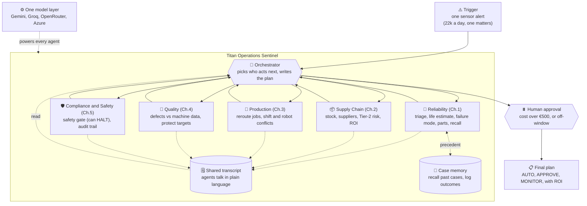

# 🛰️ Titan Operations Sentinel (TOS)

> A team of AI agents for a smart factory. When one sensor alert comes in, the agents
> work across maintenance, supply chain, production, quality, and safety, then hand a
> human one costed, safety-checked action plan to approve.

Group project for IE University, Agentic AI for IT. It is built on LangGraph. Each agent
is an autonomous ReAct agent, and the model layer is provider-agnostic (Gemini, Groq,
OpenRouter, or Azure OpenAI, switchable while it runs). It runs end to end on a free tier,
with no paid keys required.

6 agents. 5 case-study challenges. 79.7:1 action ROI. Free to run on a free tier. 26 offline tests.

---

## Contents

1. [The problem](#the-problem)
2. [The solution](#the-solution)
3. [Architecture](#architecture)
4. [The agents](#the-agents)
5. [How it works](#how-it-works)
6. [The learning loop](#the-learning-loop)
7. [Autonomy and safety](#autonomy-and-safety)
8. [The three demo paths](#the-three-demo-paths)
9. [Worked example: the Friday Cascade](#worked-example-the-friday-cascade)
10. [Quick start (CLI)](#quick-start-cli)
11. [The web console](#the-web-console)
12. [Providers and models](#providers-and-models)
13. [Testing](#testing)
14. [Trace events](#trace-events)
15. [Repository layout](#repository-layout)
16. [Design choices](#design-choices)
17. [How it maps to the assignment](#how-it-maps-to-the-assignment)
18. [Key numbers](#key-numbers)
19. [Status and limitations](#status-and-limitations)
20. [Docs and appendix](#docs-and-appendix)
21. [Team](#team)

---

## The problem

Titan Manufacturing runs 28 plants of robots bolted onto aging factory technology. The
core pain is that every team only sees its own slice of the problem, and the decisions are
all made by hand:

| # | Challenge | What it costs (from the case study) |
|---|-----------|-------------------------------------|
| 1 | Predictive maintenance | 22,000+ alerts a day with no ranking. €180k a day when a CNC machine goes down. 38% of failures "should have been predicted". |
| 2 | Supply-chain volatility | €14M in line stoppages last quarter. Rush-order costs up 52%. No visibility past Tier-1 suppliers. |
| 3 | Human-robot coordination | 17% of shifts hit robot or operator conflicts. Safety shutdowns up 15%. |
| 4 | Quality and traceability | Quality escapes up 22%. Finding a defect's root cause takes weeks. Quality records are not linked to machine data. |
| 5 | Compliance, safety, and audit | Gaps in the OSHA logs. Audits cross-reference 20+ systems by hand. |

A dashboard shows you the data. A rules-based script follows fixed steps. Neither one
reasons across the silos when something goes wrong, which is exactly what is needed and
what an agent system can do.

## The solution

When a failure signal appears, TOS does not just open a ticket. It runs the whole
response: it diagnoses the failure, recalls similar past cases, finds the parts, reroutes
production without breaking the shift plan, checks the quality impact, gets a safety
sign-off, works out the ROI, and drafts the approval request. One alert flows through all
five challenges as a single coordinated response, with a human stepping in only where real
authority is needed.

---

## Architecture



How to read it:

1. A sensor alert comes in.
2. The orchestrator sends it to one specialist agent at a time.
3. Each agent calls its own tools and writes a plain-language report that the others can read.
4. Before anything is committed, Compliance and Safety checks it, and a human approves any real spending.
5. Out comes a tiered action plan, and the run is saved to case memory.

---

## The agents

| Agent | Challenge | Decides | Key tools |
|-------|-----------|---------|-----------|
| Orchestrator | coordination | who acts next, and the final tiered plan | (routing only) |
| Reliability | 1 | which alert matters, remaining life, failure mode, parts, past cases | `alert_triage`, `sensor_query`, `rul_predictor`, `recall_similar_cases`, `asset_profile` |
| Supply Chain | 2 | the parts gap, the best option by ROI, hidden Tier-2 risk | `parts_inventory`, `supplier_catalog`, `expedite_cost`, `tier2_supplier_risk` |
| Production and Human-Robot | 3 | how to reroute jobs without a staffing or robot conflict | `job_reroute`, `robot_cell_status`, `shift_conflict_check` |
| Quality and Traceability | 4 | whether the fault is causing defects, and whether the backup machines are safe | `quality_history`, `telemetry_correlate` |
| Compliance and Safety | 5 | check every action against OSHA (can HALT), and build the audit trail | `safety_gate`, `audit_assemble` |

The agents decide, the tools act. The agents interpret, plan, and choose tools. The tools
only fetch data, do the math, or draft documents. They never make decisions or commit
anything irreversible. Shared scheduling tools: `maintenance_schedule`, `work_order_draft`,
`notify`.

---

## How it works

- Autonomous specialists. Each agent is a LangGraph `create_react_agent`. Its model picks which of its own tools to call and keeps going until it is done.
- Guided routing. The orchestrator (a model) decides who runs next, but a code policy (`_allowed_next()`) makes sure every high-risk event is fully covered and always ends with the safety gate, so it cannot loop forever or skip safety. Each routing step is tagged in the trace as either "LLM-picked" or "forced".
- Plain-language teamwork. Every agent adds its full report to one shared transcript that all later agents read. An agent can end with `FOLLOWUP: <agent> — <question>` to ask another specialist directly. This is checked against the agent list and capped by `MAX_VISITS` so it cannot loop.
- Structured verdicts. Risk, HALT, and escalate are read from real tool fields (`rul_predictor.failure_mode`, `safety_gate.verdict`), with text matching only as a backup.
- Safety override. Compliance and Safety can return HALT, which stops the whole plan no matter the cost or urgency.
- Human in the loop. Any spend over €500 (or an option that does not fit the failure window) pauses the graph with `interrupt()` and waits for a real approve or reject. The pause uses a LangGraph `MemorySaver` checkpointer, which also acts as the run's short-term memory, so the graph stops and resumes cleanly.
- Full audit trail. Every reading, tool call, decision, and approval is written to `logs/tos_audit.jsonl`, and you can replay it later with `scripts/view_run.py`.

---

## The learning loop

The cycle is perceive, reason, act, learn, without ever retraining the model. Four parts:

| Part | Status | What it does |
|---|---|---|
| Case memory (recall) | live | `recall_similar_cases` pulls the closest past case (its predicted vs actual life, decision, and outcome) into the Reliability agent, so it reasons from precedent. |
| Write-back | live | `graph.synthesize()` saves every finished run to `data/memory/case_library.json` with its predicted life window (`append_case`). |
| Outcome validation (reconcile) | live, self-closing | `reconcile_due()` runs at the start of each run. When an outcome is known (a feed writes `data/memory/outcomes.json`), it closes the case and updates the life-estimate accuracy. It safely does nothing if there is no feed. |
| Reflection and signature down-weighting | design-stage | The `self_eval` prompt scores each plan today. Saving and replaying those critiques, and automatically down-weighting signatures that miss, is the planned next step (labelled "design" in the console). |

All the live parts are unit-tested (`test_append_case_grows_library`,
`test_reconcile_closes_the_loop`, `test_reconcile_due_resolves_known_outcomes`).

---

## Autonomy and safety

Actions fall into three tiers, and the spending ceiling is enforced in code, not just the prompt.

| Tier | Example actions | Who approves |
|------|-----------------|--------------|
| AUTO | throttle within OEM limits, reroute jobs, update logs, draft a work order | nobody, the agent does it |
| APPROVE | any purchase, or an emergency maintenance window | plant manager (through the gate) |
| ESCALATE | anything touching safety systems | safety officer |

- The €500 ceiling is enforced in code. An option runs on its own only if it is under €500 and fits the failure window. Otherwise the run pauses for a human. (See the supply_chain step in `graph.py`, with tests for both branches.)
- A Compliance HALT overrides everything.
- It abstains on thin data. If the telemetry drops out, Reliability refuses to invent a life estimate, and the run escalates for a manual check. This is deterministic and uses no tokens.
- It fails toward caution. A failed agent or tool becomes a noted error, and a Reliability error sets risk to HIGH.

---

## The three demo paths

| Path | Trigger | What the agents do |
|------|---------|--------------------|
| Cascade (happy path) | Friday Cascade alert | The full team runs: rush the parts, reroute jobs around conflicts, confirm quality, get safety sign-off, a human approves, and out comes a costed plan. |
| Edge | Supplier disruption | Supply Chain finds nothing that fits the failure window, so it adapts to a cross-plant transfer (€420, under the ceiling, so it runs on its own with no gate). |
| Escalation | Telemetry dropout | Reliability refuses to predict on partial data, so the orchestrator stops and escalates for a manual check. |

---

## Worked example: the Friday Cascade

Trigger: `ALT-22847`, machine CNC-07-LEI, vibration 7.2 mm/s (limit 6.0), up from 3.1 over the last 6 hours.

1. Reliability sorts the 22k alerts down to CNC-07-LEI. `recall_similar_cases` finds INC-0288 (a 93% match: same signature, it failed at 58h last time, the rush order was approved and worked). `rul_predictor` estimates 52 to 76 hours of life left, a spindle-bearing failure, parts P-4421 and P-7803. Risk is HIGH.
2. Supply Chain confirms P-4421 is at 0 on site. Schaeffler can rush it in 18 hours for €3,200. `expedite_cost` works out an ROI of 79.7 to 1 against €7,500 an hour of downtime. Tier-2 risk is low. €3,200 is over €500, so this goes to the human gate.
3. Production sees that CNC-05 has an operator conflict, so it adapts to the idle CNC-08, reroutes jobs J4421 to J4425, and sends a `FOLLOWUP` question to Quality.
4. Quality confirms the vibration is linked to defects (r = 0.82) and that CNC-08 is within spec, so it is safe to take the extra load.
5. Compliance and Safety checks all four actions against OSHA and OEM limits, signs off, and assembles the audit trail.
6. Human gate: the plant manager approves the €3,200 rush order and the Saturday window.
7. Plan: `[AUTO]` throttle and reroute, `[APPROVE]` rush order and window, `[MONITOR]` vibration. ROI 79.7 to 1. The finished run is saved to case memory.

---

## Quick start (CLI)

```bash
pip install -r requirements.txt        # install dependencies
cp .env.example .env                   # add a free key (Gemini or Groq, see docs/SETUP_GEMINI.md), or run offline with Ollama

python scripts/run_demo.py             # happy path (auto-approves)
python scripts/run_demo.py edge        # cross-plant adaptation path
python scripts/run_demo.py escalation  # telemetry dropout, goes to human review
python scripts/view_run.py             # replay the last recorded run (no tokens)
python -m pytest tests/test_tools.py   # 26 offline tool tests (no key needed)
```

Run all commands from the repo root. The model is set by `TOS_MODEL` (for example
`google_genai:gemini-2.5-flash`, or the default `groq:llama-3.3-70b-versatile`). If
`TOS_MODEL` is unset, it auto-detects the first provider whose key it finds. Use
`ollama:llama3.1:8b` for a fully offline run.

Free-tier note: a full six-agent run is about 40 model calls and 18k tokens, so free tiers
can rate-limit. To replay past runs for free, use `scripts/view_run.py` or the console's
Replay mode. You can also point `TOS_MODEL` at a local Ollama model, or use Azure credits
for higher limits.

---

## The web console

A React/Vite and FastAPI console that shows a run in real time. Open it at
`http://localhost:5173` in dev. (If 5173 is busy, Vite picks the next free port and prints it.)

```bash
# Replay (recommended: free, no key, can't fail):
cd webapp/frontend && npm install && npm run dev

# Live (real model). Also start the backend from the repo root:
python -m uvicorn main:app --app-dir webapp/backend --port 8000
```

What's inside:

- Orchestration graph. Watch the orchestrator route the six agents in real time, with animated edges and hover tooltips. Each agent is tagged LLM-routed or auto-routed.
- Three scenarios (Cascade, Edge, Escalation), plus the €500 human approval gate.
- Agent Chat. Type a problem in plain language and it dispatches the agents.
- Learning view. Recalled past cases, decision patterns, reflection (design-stage), and life-estimate accuracy.
- Plant Fleet. Inspect any machine. The one with the alert opens its full profile.
- Cost and Feasibility, Audit Log, and Run History (with Markdown report export).
- Presenter auto-play, a ⌘K command palette, and per-presenter sign-in.
- A Replay vs Live toggle and an in-app provider and key picker. Replay is a clearly labelled recording.
- A slide deck at `/deck.html` for the pitch.

The FastAPI backend (`webapp/backend/main.py`) exposes:

- `GET /api/run`, streams the live trace as Server-Sent Events
- `POST /api/decision`, resolves the approval pause
- `GET /api/providers`
- `POST /api/config`, switches provider, model, or key while it runs, and can save to `.env`
- `GET /api/health`

See [`webapp/README.md`](webapp/README.md) for details.

---

## Providers and models

The model layer is provider-agnostic through `init_chat_model`. Switch by setting
`TOS_MODEL`, dropping a key in `.env`, or using the console's picker (which can also save
to `.env`).

| Provider | `TOS_MODEL` prefix | Env key(s) | Notes |
|----------|--------------------|------------|-------|
| Gemini | `google_genai:` | `GEMINI_API_KEY` or `GOOGLE_API_KEY` | free tier, the most token headroom for a full run |
| Groq | `groq:` | `GROQ_API_KEY` | free and fast. Use `llama-3.3-70b-versatile` (the `8b-instant` token limit is too small). |
| OpenRouter | `openrouter:` | `OPENROUTER_API_KEY` | one key, many free models. Best when another tier rate-limits. |
| Azure OpenAI | `azure_openai:` | `AZURE_OPENAI_API_KEY` plus `AZURE_OPENAI_ENDPOINT` and `OPENAI_API_VERSION` | paid-tier limits (good with student credits). The model name is your deployment name. |
| OpenAI, Anthropic, Mistral | `openai:`, `anthropic:`, `mistralai:` | the matching key | paid or free tiers |
| Ollama | `ollama:` | none | fully local and offline, no key |

If no provider is reachable, the routing and synthesis calls fall back to a fixed template,
so the graph, tools, and tests still run offline. (The ReAct agents still need a real
tool-calling model.)

---

## Testing

```bash
python -m pytest tests/test_tools.py   # 26 offline tool tests (no key): tools, ROI math,
                                       # the €500-and-window gate, case recall, append, reconcile
python -m pytest tests/                # also runs the multi-agent flow tests (need a key, skipped otherwise)
```

The offline suite checks every headline number (such as ROI 79.7 to 1 and the ceiling
decision) and the learning loop's write-back and reconcile, so the claims in this README
and the deck are backed by tests.

---

## Trace events

Each node adds typed events to the graph state `trace` (and to the audit log). The demo and
the web console render the same shapes, so what you rehearse on Replay matches a Live run.

```python
{"type": "perception",       "alert": dict, "message": str}
{"type": "route",            "agent": "orchestrator", "to": str, "allowed": list, "how": "forced|LLM-picked"}
{"type": "tool_call",        "agent": str, "tool": str, "input": dict, "result": any}
{"type": "agent_report",     "agent": str, "report": str, "risk": str?}
{"type": "agent_error",      "agent": str, "error": str}       # noted error, the run continues
{"type": "decision"|"escalation", "agent": str, "message": str}
{"type": "approval_request", "question": str, "ceiling_eur": int, "amount_eur": int}
{"type": "human_decision",   "decision": str, "by": str}
{"type": "plan",             "status": str, "lines": list, "roi": str}
```

---

## Repository layout

```
graph.py            orchestration: supervisor, worker nodes, shared transcript, approval gate, learning hooks
agents/             the 5 specialist ReAct agents (factory.py builds them from prompts and tools)
tools/              19 domain tools plus recall_cases (case memory) and lc.py (@tool wrappers); see docs/tool_catalog.md
prompts/            5 agent prompts, plus supervisor, orchestrator, guardrails, and self-eval
data/              scenario data per challenge (alerts, sensors, assets, suppliers, production, quality, compliance)
data/memory/        case_library.json (the experience base) and outcomes.json (the feed for reconcile)
llm.py              model factory: get_chat_model() for agents, complete() for routing and synthesis
audit_log.py        writes the JSONL audit trail to logs/tos_audit.jsonl
scripts/            CLI entrypoints: run_demo.py, view_run.py
webapp/             web console (React/Vite frontend, FastAPI SSE backend); public/deck.html is the slide deck
tests/              tool tests (offline) and multi-agent flow tests (need a key)
docs/               brief, brainstorm, case study, tool_catalog, architecture.mmd, and docs/appendix/*
CLAUDE.md           project guide for contributors and Claude Code (read first)
```

---

## Design choices

- Code vs model. The judgement calls are the model's: who runs next, the assessments, the final plan, and the tool choices. The guarantees are in code: coverage, termination, the €500 ceiling, and the safety gate. So the system is autonomous but cannot run away. Covering all five challenges on a high-risk event is a deliberate guarantee, not a limitation.
- Why many agents, not one big one. Five focused agents with about three tools each make better tool choices than one agent juggling around twenty, and they match the real org silos the case study is about joining up.
- Why simulated data. Real SCADA and SAP integration needs OT access and months of pipelines. The tools read realistic JSON shaped like production systems, so the agent behaviour is representative.
- Honest labelling. The stubs, the heuristic life estimate, Replay vs Live, and live vs design-stage learning are all labelled as such in the code, the docs, the console, and the deck.

---

## How it maps to the assignment

The brief's eight design-thinking pillars and the 100-point rubric, each backed by a file
or feature, are mapped in
[`docs/appendix/evidence_checklist.md`](docs/appendix/evidence_checklist.md). In short:
goals (this README and `why_agent_not_dashboard.md`), architecture (`graph.py`,
`architecture.mmd`), tools (`docs/tool_catalog.md`), lifecycle including learning
(`graph.py` and the Learning view), risks and human-in-the-loop (`risk_matrix.md`,
`failure_modes.md`, `confidence_policy.md`), the example run (the demo), and the stack
(above). Honest answers to likely questions are in
[`docs/appendix/anticipated_questions.md`](docs/appendix/anticipated_questions.md).

## Key numbers

- €180,000 a day, which is €7,500 an hour: the machine's production value at risk (`data/assets/asset_profiles.json`).
- ROI 79.7 to 1: (52h window minus 18h lead time) times €7,500 an hour is €255,000 of downtime avoided, divided by the €3,200 rush order. We cost it against the earliest predicted failure (52h) on purpose, for the most conservative figure.
- About 18k tokens and 40 model calls per full run (after a 62% transcript trim), which is €0 on free tiers.
- 6 agents (orchestrator plus 5 specialists), 5 challenges, 26 offline tests.

---

## Status and limitations

- ✅ Tools, graph, all 5 challenges, the learning loop, audit log, web console, and 26 offline tool tests passing.
- ✅ Learning loop (case-memory recall, write-back, and self-closing reconcile) and a code-enforced €500 ceiling (a cheaper option must also fit the failure window to run on its own).
- ✅ Provider-agnostic with an in-app picker (Gemini, Groq, OpenRouter, Azure). The happy and edge paths are verified live, end to end.
- ✅ The web console plays all three paths, in Replay (free, no key) or Live, with the orchestration graph, approval gate, agent chat, Learning view, run history, and the slide deck at `/deck.html`.
- ⚠️ The life estimate is a heuristic, not a trained model. It is an honest MVP stub. The data is simulated, but shaped like production data.
- ⚠️ Reflection-replay and automatic signature down-weighting are designed but not yet live (labelled "design" in the console). Live reconcile does nothing until an outcomes feed exists. Live runs are limited by free-tier token budgets.

---

## Docs and appendix

In [`docs/`](docs/) and [`docs/appendix/`](docs/appendix/):

- Prompt pack: `appendix/prompt_pack.md` (all the system, guardrail, and self-eval prompts)
- Tool catalog: `tool_catalog.md` (each tool: inputs, outputs, when to use and when not to, fallback, auth tier)
- Risk and safety: `appendix/risk_matrix.md`, `appendix/failure_modes.md`, `appendix/confidence_policy.md`
- Architecture and flow: `architecture.mmd`, `appendix/sequence_diagram.md`, `appendix/audit_log_schema.md`
- Why an agent, not a dashboard: `appendix/why_agent_not_dashboard.md`
- Evidence checklist and anticipated Q&A: `appendix/evidence_checklist.md`, `appendix/anticipated_questions.md`
- Presentation Q&A prep and eval metrics: `appendix/qa_cheatsheet.md`, `appendix/evaluation_metrics.md`
- Golden-run recording guide: `appendix/RECORDING.md`
- Setup and progress: `SETUP_GEMINI.md`, `PROGRESS.md`, and the design-thinking handouts
- Project brief and case study: `agentic_assignment_brief.md`, `titan_project_brainstorm.md`, and the case-study doc

---

## Team

IE University, MBDS, Agentic AI for IT. Team 3. Presentation June 24, 2026:
Marco Ortiz Togashi, David Carrillo Aguilera, Nuria Diaz Jimenez, Marian Garabana Garrido,
Ignacio Agustin Moreno.

> Built with LangGraph. Every stub, heuristic, and design-stage feature is labelled as
> such, in the code, the docs, the console, and the deck.
