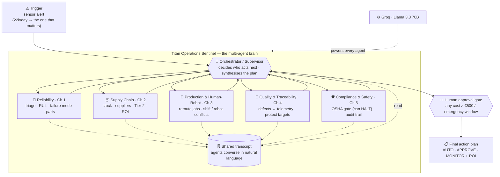

# 🛰️ Titan Operations Sentinel (TOS)

> A multi-agent **operations brain** for a smart factory. One sensor alert sets off a team of
> AI agents that reason across maintenance, supply chain, production, quality and safety — and
> hand a single, costed action plan to a human for approval.

Group project for **IE University — Agentic AI for IT**. Built on **LangGraph** with autonomous
**ReAct** agents running on **Groq / Llama 3.3 70B** (free tier — no paid API keys).

---

## Architecture at a glance



**Read it as:** a trigger arrives → the **orchestrator** routes it to specialist agents one at a
time → each agent does its own tool-calling and writes a natural-language report to a **shared
transcript** the others read → before anything commits, **Compliance & Safety** gates it and a
**human** approves the spend → a tiered **action plan** comes out.

---

## The problem (the case study)

Titan Manufacturing runs 28 plants of robots bolted onto aging operational technology. Its pain is
**fragmented intelligence and manual decision loops** — every team sees its own slice:

| # | Challenge | The hurt (from the case study) |
|---|-----------|--------------------------------|
| 1 | Predictive maintenance | 22,000+ alerts/day with no prioritisation; **€180k/day** when a CNC goes down; 38% of failures "should have been predicted" |
| 2 | Supply-chain volatility | **€14M** in line stoppages last quarter; expediting costs up 52%; zero visibility past Tier-1 suppliers |
| 3 | Human-robot coordination | 17% of shifts hit robot/operator conflicts; safety shutdowns up 15% |
| 4 | Quality & traceability | quality escapes up 22%; defect root-cause takes weeks; QMS not linked to machine telemetry |
| 5 | Compliance, safety & audit | OSHA log gaps; audits cross-reference 20+ systems by hand |

A dashboard shows the data. An automation script follows fixed rules. **Neither reasons across the
silos when something goes wrong** — which is exactly what's needed, and what an agentic system does.

## The solution

When a failure signal appears, TOS doesn't just raise a ticket — it **runs the whole response**:
diagnoses the failure, finds the parts, reroutes production without breaking the shift plan, checks
the quality fallout, gets a safety sign-off, computes the ROI, and drafts the approval request. One
event flows through **all five challenges** as a single coordinated cascade, with a human kept in the
loop only where authority is actually required.

## The agents

| Agent | Challenge | Decides | Key tools |
|-------|-----------|---------|-----------|
| **Orchestrator** | coordination | who acts next; the final tiered plan | (routing only) |
| **Reliability** | 1 | which alert matters, RUL, failure mode, parts needed | `alert_triage`, `sensor_query`, `rul_predictor`, `asset_profile` |
| **Supply Chain** | 2 | parts gap, sourcing option by ROI, hidden Tier-2 risk | `parts_inventory`, `supplier_catalog`, `expedite_cost`, `tier2_supplier_risk` |
| **Production & Human-Robot** | 3 | how to reroute jobs without a staffing/robot conflict | `job_reroute`, `robot_cell_status`, `shift_conflict_check` |
| **Quality & Traceability** | 4 | is the fault causing defects; are reroute targets safe | `quality_history`, `telemetry_correlate` |
| **Compliance & Safety** | 5 | gate every action vs OSHA (can **HALT**); build audit trail | `safety_gate`, `audit_assemble` |

> **Agent decides → tools act.** The agents interpret, plan and choose tools; the tools only fetch
> data, compute, or draft artifacts — they never make decisions or commit irreversible actions.

## How it works

- **Autonomous specialists.** Each agent is a LangGraph `create_react_agent` — its LLM picks which of
  its own tools to call and loops until done.
- **Guided routing.** The orchestrator (an LLM) decides who runs next, constrained by a policy that
  guarantees coverage on a high-risk event and always finishes through the safety gate (so it can't
  loop or skip safety).
- **Natural-language communication.** Every agent appends its full report to a **shared transcript**
  that all later agents read. An agent can end with `FOLLOWUP: <agent> — <question>` to put a direct
  question to another specialist (bounded so it can't loop).
- **Safety override.** Compliance & Safety can return **HALT**, which stops the whole plan regardless
  of cost or urgency.
- **Human-in-the-loop.** Any spend over €500 (or an emergency window) pauses the graph via
  `interrupt()` for a real approve/reject before anything is committed.
- **Full audit trail.** Every perception, tool call, decision and approval is written to
  `logs/tos_audit.jsonl` — replayable later with `scripts/view_run.py`.

## The three demo paths

| Path | Trigger | What the agents do |
|------|---------|--------------------|
| **Happy** | Friday Cascade alert | Full team runs → expedite parts, reroute jobs (conflict-aware), confirm quality, safety sign-off → human approves → costed plan |
| **Edge** | Supplier disruption | Supply Chain finds nothing fits the failure window → **adapts** to a cross-plant transfer from a sister plant |
| **Escalation** | Telemetry dropout | Reliability refuses to predict on partial data → orchestrator stops and escalates for manual inspection |

---

## Quick start

```bash
pip install -r requirements.txt        # install dependencies
cp .env.example .env                   # add GROQ_API_KEY — free at console.groq.com

python scripts/run_demo.py             # happy path (auto-approves)
python scripts/run_demo.py edge        # cross-plant adaptation path
python scripts/run_demo.py escalation  # telemetry dropout → human review
python scripts/view_run.py             # replay the last recorded run (no tokens)
python -m pytest tests/test_tools.py   # 26 offline tool tests — no key needed

cd webapp/frontend && npm install && npm run dev   # demo UI: live multi-agent trace + approval gate (see webapp/README.md)
```

Run commands **from the repo root**. The model is set by `TOS_MODEL`
(default `groq:llama-3.3-70b-versatile`); swap to `ollama:llama3.1:8b` for an offline / no-quota run.

> **Free-tier note:** Groq's free tier is ~100k tokens/day. The 6-agent system is token-heavy — a few
> full runs can exhaust it. Use `scripts/view_run.py` to replay past runs for free, or point
> `TOS_MODEL` at a local Ollama model.

## Repository layout

```
graph.py            orchestration: supervisor + worker nodes + shared transcript + approval gate
agents/             the 5 specialist ReAct agents (factory.py builds them from prompts + tools)
tools/              19 tool functions + lc.py (the @tool wrappers); see docs/tool_catalog.md
prompts/            5 agent prompts + supervisor + guardrails + self-eval
data/               scenario data per challenge (alerts, sensors, assets, suppliers,
                    production, quality, compliance)
llm.py              model factory: get_chat_model() for agents; complete() for routing/synthesis
audit_log.py        JSONL audit trail → logs/tos_audit.jsonl
scripts/            CLI entrypoints: run_demo.py, view_run.py
webapp/             web console (React/Vite frontend + FastAPI SSE backend) — see webapp/README.md
tests/              tool tests (offline) + multi-agent flow tests (need a key)
docs/               assignment brief, brainstorm, case study, PROGRESS.md, tool_catalog.md, architecture.mmd
CLAUDE.md           project guide for contributors / Claude Code — read first
```

## Design choices worth knowing

- **Deterministic vs model-driven.** The *judgement* is the LLM's (which agent next, the assessments,
  the final plan). The *guarantees* are code (coverage, termination, the €500 ceiling, the safety
  gate) — so the system is autonomous but can't run away.
- **Why multi-agent, not one big agent.** Five focused agents with ~3 tools each make far better
  tool choices than one agent juggling 19 tools — and they mirror the real org silos the case study
  is about uniting.
- **Why simulated data.** Real SCADA/SAP integration needs OT access and months of pipelines; the
  tools read realistic JSON with production-shaped schemas, so the *agent behaviour* is representative.

## Status & limitations

- ✅ Tools, graph, all 5 challenges, audit log, web console, 26 offline tool tests passing.
- ✅ Happy + edge paths verified live on Groq end-to-end.
- ⚠️ Heuristic RUL (not a trained model) — honest MVP stub. Simulated data only. English-only.
- ⚠️ Live runs are bounded by the Groq free-tier daily token budget.

See [`docs/`](docs/) for the full prompt pack, tool catalog, risk matrix, and the project brief.
