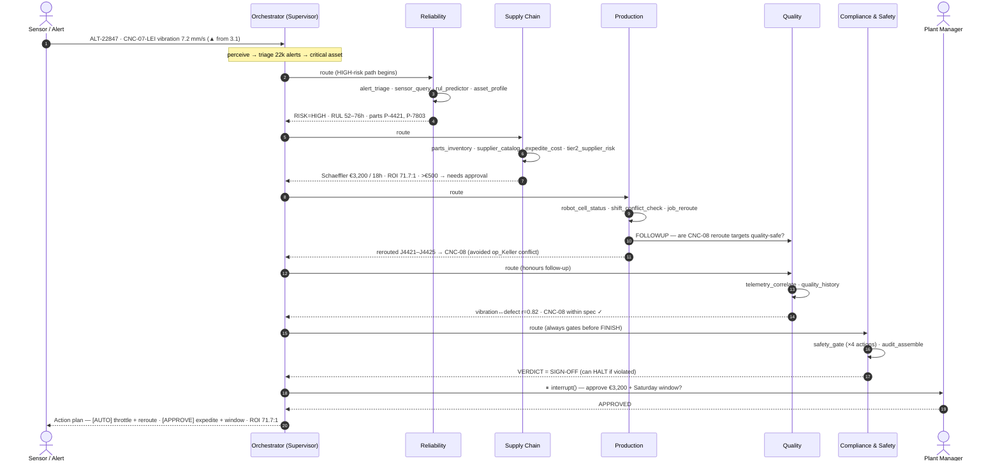

# Agent Trace — Sequence Diagram (the Friday Cascade)

Appendix artifact (brief §16 "Elite": *sequence diagram / agent trace*). A full happy-path run,
node by node, exactly as the engine executes it. Renders on GitHub / any mermaid viewer.



**Reading it for the rubric:** steps 1–2 are *perception*; the `route` arrows are the supervisor's
*model-driven planning*; each agent's tool list is *autonomous tool selection*; the `FOLLOWUP`
is *agent-to-agent messaging*; Compliance is the *safety gate*; the `interrupt()` is the
*human-in-the-loop*. Every arrow is a real event in `logs/tos_audit.jsonl` (see `audit_log_schema.md`).
```
